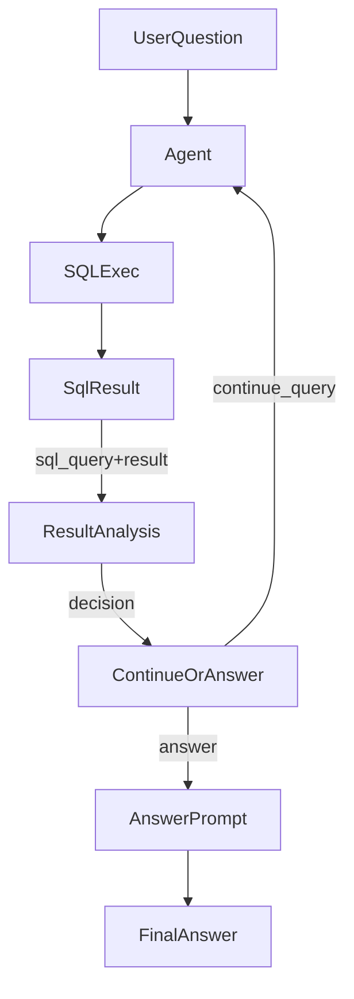

# Result Analyzer 重构计划

## 目标

- 让结果分析与答案生成更“泛化”：不靠字段硬编码，依赖 LLM 理解语义和数据结构来决定是否需要并列处理、是否需要继续查询，以及如何完整呈现结果。
- 对“前N名 + 并列”场景给出稳定、可复用的生成策略：列满N名后遇到并列则扩展，不只停留在第一名并列。

## 关键改动点

- 更新分析链路：`analyze_result` 与 `should_continue_querying` 增强对“可能被截断/未覆盖排名边界”的判断，并在必要时提示继续查询。
- 重写答案提示词：加入清晰的“排名处理算法”，确保输出完整清单（你选择“简要结论 + 完整清单”）。

## 具体步骤

1. 在 [`C:\Users\86159\Desktop\erp_agent\erp_agent\core\result_analyzer.py`](C:\Users\86159\Desktop\erp_agent\erp_agent\core\result_analyzer.py) 中扩展分析 prompt：

   - 输入中加入 `sql_query`（从调用方传入）以及 `row_count`/列名/样本数据。
   - 明确要求 LLM 判断：
     - 是否为“排名/Top-N/比较/并列”类型问题。
     - 当前结果是否可能“只包含部分排名层级”。
     - 是否需要“继续查询以获得完整排名结果”。
   - 在分析返回结构中新增字段（如 `needs_more_data`、`reasoning_tags`），用于 `should_continue_querying` 做决策。

2. 更新调用链：

   - 在 [`C:\Users\86159\Desktop\erp_agent\erp_agent\core\agent.py`](C:\Users\86159\Desktop\erp_agent\erp_agent\core\agent.py) 中调用 `analyze_result` 时传入 `sql_query`，保证分析 prompt 能感知是否存在 LIMIT/只取部分排名的迹象。

3. 重构答案生成 prompt：

   - 在 `_build_smart_answer_prompt` 中加入“排名/并列处理算法”说明：
     - 先按关键指标排序；
     - 逐行挑选直到满足 N 名；
     - 如第 N 名存在并列，必须扩展并列；
     - 不得只输出最高并列组。
   - 保持你选择的输出风格：“简要结论 + 完整清单”。
   - 加入“基于当前查询结果”措辞约束，避免对未出现数据的断言。

4. 重构 `should_continue_querying` 逻辑：

   - 优先使用 LLM 分析返回的结构化字段，而不是简单 `is_sufficient`；
   - 如果分析明确提示“排名边界可能被截断/并列未覆盖”，则继续查询。

5. 回归检查（不改代码）：

   - 对你提供的“涨薪幅度前10名（含并列）”问题进行手动验证：
     - 输出应包含至少 10 人（除非并列导致超过 10）且不会停留在单一并列组。

## 关键片段（需修改的函数）

- `ResultAnalyzer.analyze_result` 与 `_build_analysis_prompt`
- `ResultAnalyzer._build_smart_answer_prompt`
- `ResultAnalyzer.should_continue_querying`
- `Agent.query` 调用链（传入 `sql_query` 给分析器）

## 数据流示意

